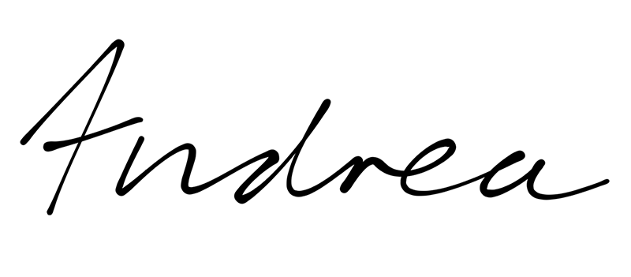

# My Blog

This blog is built with **Next.js**. It is build to allow you to write Markdown and focus on the _content_ of your blog. This starter includes:

- Automatically configured to handle Markdown/MDX
- Generates an RSS feed based on your posts
- Easily categorize and suggest posts with tags

## Getting Started

If you like my blog and want to use it as a starter for your own, you can use the template repo I made, it is immediately deployable on Vercel and you can easily customize it to your liking. You can find it [here](ADD LINK TO REPO TEMPLATE).
